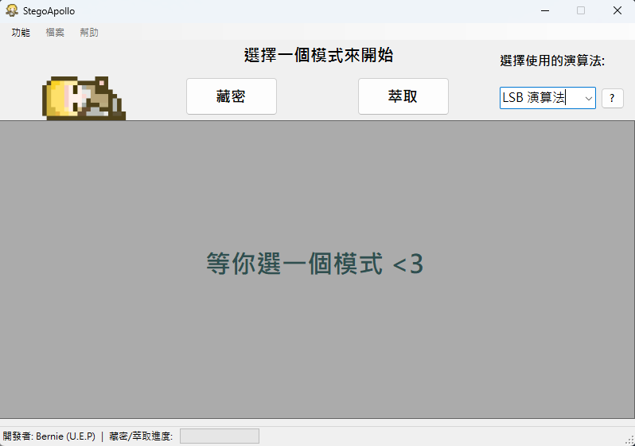
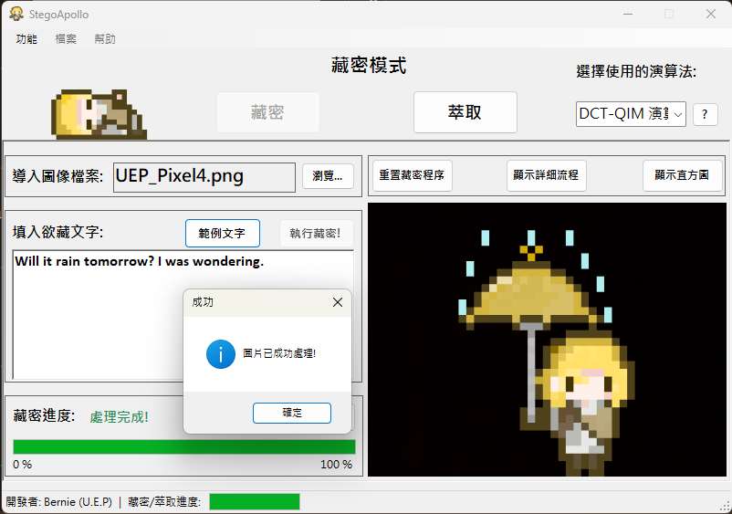
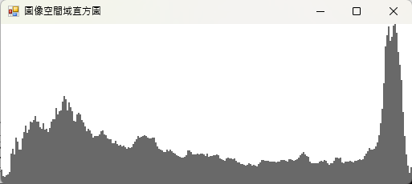
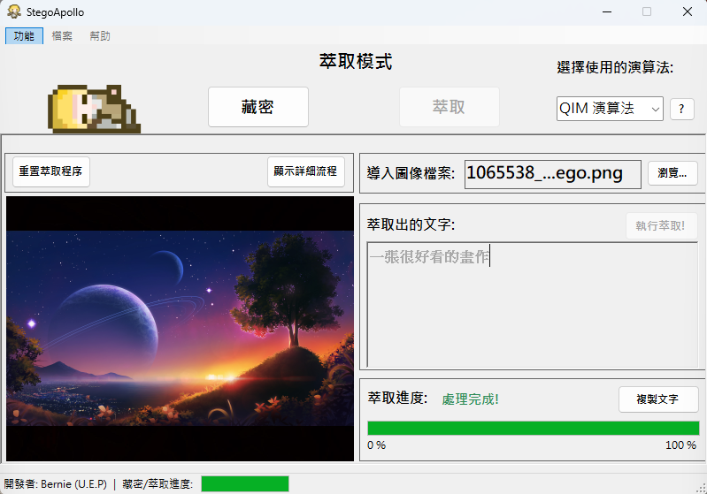

# StegoApollo - A Steganography Tool

## Overview

StegoApollo is a Windows Forms application for hiding and extracting messages within images using steganography techniques. It features both **LSB** and **QIM** embedding methods, along with visualization and logging tools for ease of use.

## Features

* **LSB Embedding/Extraction**: Hide messages in the least significant bits of R/G/B channels.
* **QIM Embedding/Extraction**: Robust Quantization Index Modulation in the grayscale channel.
* **Histogram Visualization**: Generate and display the grayscale histogram after processing (QIM only).
* **Logging Panel**: Real-time display of application actions, warnings, and errors.
* **Algorithm Explainer**: Interactive pane showing detailed algorithm descriptions for LSB and QIM.
* **Save Result**: Export the processed image in PNG format.
* **Progress Indicator**: Visual progress bar during embedding and extraction.

## Screenshots

**Initial Screen**:



**Embedding Process (With Log Screen and Explanation Screen)**:



**Histogram Visualization**:



**Extraction Process**:



## Installation

1. **Clone the repository**:

   ```bash
   git clone https://github.com/Unforgettableeternalproject/StegoApollo
   cd StegoApollo
   ```
2. **Open the solution**:

   * Launch Visual Studio and open `StegoSolution.sln`.
3. **Build projects**:

   * Build **StegoLib** (Class Library).
   * Build **StegoApp** (WinForms Application).
4. **Run the application**:

   * Set `StegoApp` as the startup project and press F5.

## Usage

--Embedding--
1. **Select Image**: Choose an image file to embed a message.
2. **Select Method**: Choose between LSB or QIM for embedding.
3. **Enter Message**: Type the message you want to hide.
4. **Start Embedding**: Click the "Embed" button to start the process.
5. **Save Result**: After embedding, save the processed image.

--Extraction--
1. **Select Image**: Choose the image file from which you want to extract a message.
1. **Select Method**: Choose between LSB or QIM for extraction.
1. **Start Extraction**: Click the "Extract" button to start the process.
1. **View Message**: The extracted message will be displayed in the text box.
1. **Save Result**: After extraction, copy the extracted message to clipboard.

## To-Do List

- [ ] Add more visualization options for LSB and QIM.
- [ ] Implement error handling for unsupported image formats.
- [ ] Add unit tests for the embedding and extraction algorithms.
- [ ] Improve the UI/UX for better user experience.

## Contributing

Contributions are welcome! Please open issues or submit pull requests on GitHub.

## Contact

If you have any questions or suggestions, please contact our development team via [](mailto:ptyc4076@gmail.com).
