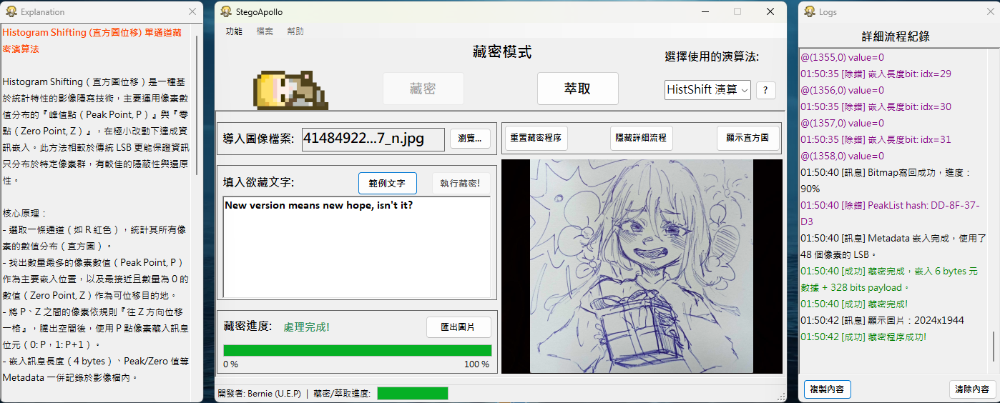

### This project provides multilanguage README.md file
[](https://github.com/Unforgettableeternalproject/StegoApollo/blob/master/README.md) [](https://github.com/Unforgettableeternalproject/StegoApollo/blob/master/README.zh-tw.md)

---

# StegoApollo - A Steganography Tool

## Overview

StegoApollo is a Windows Forms application for hiding and extracting messages within images using multiple steganography algorithms. It provides rich visualization, detailed logging, and an improved user experience, making it suitable for both learning and practical use.

## Features

* **LSB Embedding/Extraction**: Hide messages in the least significant bits of the RGB channels.
* **QIM Embedding/Extraction**: Quantization Index Modulation in the grayscale channel, robust against noise.
* **DCT-QIM Embedding/Extraction**: Combines frequency domain (DCT) and QIM, embedding information in mid-frequency coefficients for high concealment and compression resistance.
* **HistShift (Histogram Shifting) Embedding/Extraction**: Embeds data only in the densest pixel value regions, supporting reversible data hiding.
* **Histogram Visualization**: Generate and display the R channel histogram at any time, regardless of the algorithm.
* **Logging Panel**: Real-time display of actions, warnings, errors, and debug information.
* **Algorithm Explainer**: Interactive window with detailed explanations for all supported algorithms.
* **Progress Indicator**: Progress bar with fine-grained stage updates during embedding and extraction.
* **Debug Mode**: Toggleable; when enabled, shows more detailed debug logs for learning and troubleshooting.
* **Save Result**: Export processed images as PNG files.
* **Enhanced User Experience**: More intuitive workflow, clearer error messages, and smoother operation.

## Screenshots

**Main Screen**:


**Embedding Process**:


**Histogram Visualization (available for all algorithms)**:


**Extraction Process**:


**Full Expandable**:



## Installation

1. **Clone the repository**:
	```bash
	git clone https://github.com/Unforgettableeternalproject/StegoApollo
	cd StegoApollo
	```

2. **Open the solution**:
* Open `StegoSolution.sln` in Visual Studio.

3. **Build projects**:
* Build **StegoLib** (Class Library).
* Build **StegoApolloUI** (WinForms Application).

4. **Run the application**:
* Set `StegoApolloUI` as the startup project and press F5.


## Usage

### Embedding

1. **Select Image**: Load the image you want to embed a message into.
2. **Select Algorithm**: Choose from LSB, QIM, DCT-QIM, or HistShift.
3. **Enter Message**: Type the message you want to hide.
4. **Start Embedding**: Click the "Embed" button.
5. **Save Result**: Save the processed image after embedding.

### Extraction

1. **Select Image**: Load the image you want to extract a message from.
2. **Select Algorithm**: Choose from LSB, QIM, DCT-QIM, or HistShift.
3. **Start Extraction**: Click the "Extract" button.
4. **View Message**: The extracted message will be displayed in the text box.
5. **Save Result**: Copy the message or save the restored image.

### Other Features

- **Histogram Visualization**: Generate and view the R channel histogram at any time, regardless of the algorithm.
- **Debug Mode**: Toggle from the menu; when enabled, logs will include more detailed information (e.g., embedding details, coordinates, payload).
- **Algorithm Explanation**: Click the explanation button to view the principles and pros/cons of each algorithm.

## What's New

- Added **HistShift (Histogram Shifting)** and **DCT-QIM (Frequency Domain Quantization Index Modulation)** algorithms.
- Progress bar now shows more detailed, stage-based progress.
- Histogram visualization is now available for all algorithms.
- Added a "Debug Mode" option for advanced users to track detailed process information.
- Multiple UI/UX improvements for a smoother and more user-friendly experience.

## To-Do List

- [ ] Add more visualization options (e.g., highlight embedding points).
- [ ] Improve error handling and format support.
- [ ] Add unit tests for algorithms.
- [ ] Continue optimizing UI/UX.

## Contributing

Contributions are welcome! Please open issues or submit pull requests on GitHub.

## Contact

If you have any questions or suggestions, please contact our development team via [](mailto:ptyc4076@gmail.com).
