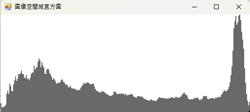
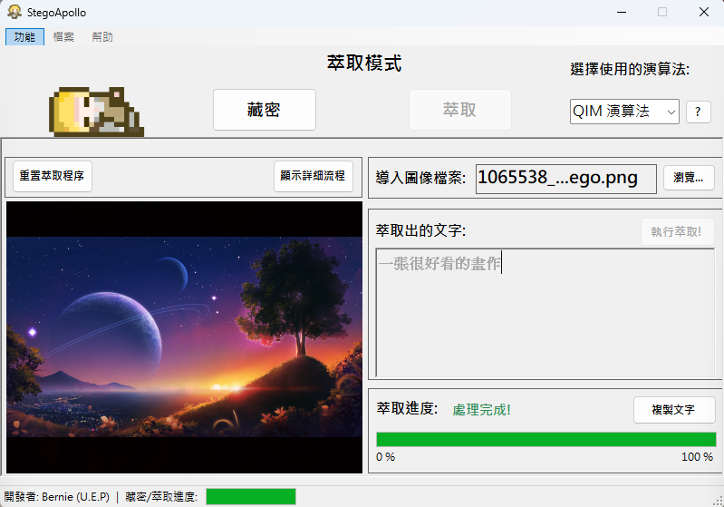

### 此專案提供多種語言之README文件
[](https://github.com/Unforgettableeternalproject/StegoApollo/blob/master/README.md) [](https://github.com/Unforgettableeternalproject/StegoApollo/blob/master/README.zh-tw.md)

---

# StegoApollo - 簡易的圖像藏密工具

## 簡要介紹

StegoApollo 是一款 Windows Forms 圖像藏密工具，支援多種嵌入與萃取演算法，並提供豐富的視覺化與日誌功能，讓使用者能輕鬆體驗與學習資訊隱藏技術。

## 功能

* **LSB 嵌入/萃取**：將訊息隱藏於 RGB 各通道的最低有效位元。
* **QIM 嵌入/萃取**：灰階通道的量化指數調變，具備抗干擾能力。
* **DCT-QIM 嵌入/萃取**：頻域（DCT）結合 QIM，資訊嵌入於中頻係數，抗壓縮與高隱蔽性。
* **HistShift (直方圖位移) 嵌入/萃取**：僅針對像素分布最密集區間進行嵌入，支援自我還原。
* **直方圖視覺化**：可隨時產生並顯示 R 通道直方圖，無演算法限制。
* **日誌面板**：即時顯示操作流程、警告、錯誤與除錯訊息。
* **演算法說明**：互動式說明窗，詳細介紹所有支援的演算法。
* **進度指示**：嵌入與萃取過程中，進度條顯示更細緻的階段進度。
* **除錯模式**：可切換，啟用後顯示更詳細的除錯日誌，方便學習與問題追蹤。
* **結果儲存**：可將處理後圖片另存為 PNG。

## 應用程式截圖

**主畫面**：


**嵌入流程**：


**直方圖視覺化（任一演算法皆可）**：



**萃取流程**：



**全展開模式**：


## 安裝方式

1. **複製存放庫**:
   ```bash
	git clone https://github.com/Unforgettableeternalproject/StegoApollo 
    cd StegoApollo
   ```

2. **開啟解決方案**:

* 使用 Visual Studio 開啟 `StegoSolution.sln`

3. **建置專案**:

* 建置 **StegoLib** (Class Library)
* 建置 **StegoApolloUI** (WinForms Application)

4. **執行應用程式**:

* 設定 `StegoApolloUI` 為啟動專案並按 F5 執行

## Usage

### 嵌入流程

1. **選擇圖片**：載入欲嵌入訊息的圖片
2. **選擇演算法**：LSB、QIM、DCT-QIM 或 HistShift
3. **輸入訊息**：填入要隱藏的文字
4. **開始嵌入**：點擊「嵌入」開始
5. **儲存結果**：嵌入完成後可儲存圖片

### 萃取流程

1. **選擇圖片**：載入欲萃取訊息的圖片
2. **選擇演算法**：LSB、QIM、DCT-QIM 或 HistShift
3. **開始萃取**：點擊「萃取」開始
4. **查看訊息**：訊息會顯示於文字框
5. **儲存結果**：可複製訊息或儲存還原圖片

### 其他功能

- **直方圖顯示**：任一演算法下皆可點擊產生直方圖
- **除錯模式**：於選單切換，啟用後日誌顯示更詳細（如嵌入細節、座標、payload 等）
- **演算法說明**：點擊說明按鈕可查看各演算法原理與優缺點

## 新功能!

- 新增 **HistShift (直方圖位移)** 與 **DCT-QIM (頻域量化調變)** 兩種演算法
- 進度條顯示更細緻，反映每個主要步驟
- 直方圖顯示不再受演算法限制，任何時候皆可產生
- 新增「除錯模式」選項，方便進階用戶追蹤細節
- 多項 UI/UX 優化，操作更流暢、提示更友善

## 待辦事項

- [ ] 增加更多視覺化選項（如嵌入點標示）
- [ ] 強化錯誤處理與格式支援
- [ ] 增加單元測試
- [ ] 持續優化 UI/UX

## 貢獻

歡迎貢獻！請於 GitHub 上提出 issue 或 pull request。

## 聯絡方式

如有任何問題或建議，歡迎來信 [](mailto:ptyc4076@gmail.com)。
